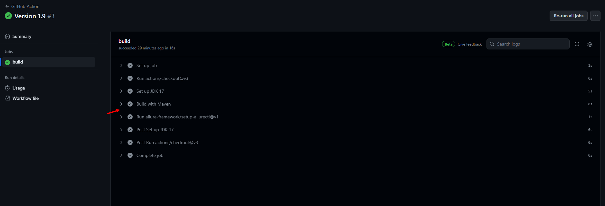
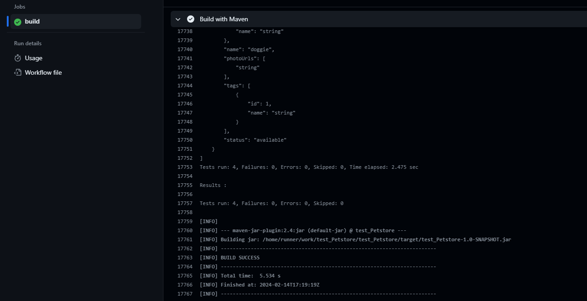
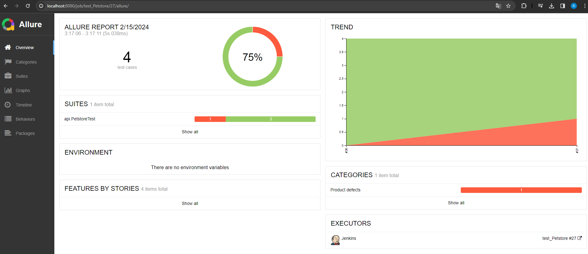

# Установка JDK на Windows 10 и 11 (Предварительные шаги для запуска проекта)

Прежде чем установить JDK на Windows 11 или 10 проверьте её наличие через командную строку с помощью команды «**`java – -version`**». Если среда уже установлена, то можно начинать работу, если же нет, то скачиваете подходящую для вашей системы с официального сайта или другого источника. Затем запускаете установочный файл и ставите комплект как обычную программу. При необходимости сразу же скачиваете и устанавливаете JVM и JRE подходящей версии.

Установка JDK на Windows 7 или 8
Установка JDK на Windows 7 ничем не отличается от установки обычной программы из zip-архива. Вручную нужно будет настроить путь до версии, чтобы используемая среда разработки могла использовать инструменты JDK. Делается это так:

Нажмите «**`Win+R`**»;
в окне введите «**`sysdm.cpl`**» и подтвердите: «**ОК**»;
во вкладке «Дополнительно» выберите «Переменные среды»;
вы увидите список переменных сред, вариант «Создать»: имя переменной: **JAVA_HOME**;
«Значение переменной»: укажите ваш путь до папки с JKD на компьютере (например, **`C:\Program Files\Java\jdk-17`**).

# Клонируем проект

1. Открыть cmd

2. Выбрать место, куда будет склонирован проект ( пример: **`cd "C:\test"`** )
3. Прописать команду: `git clone https://github.com/RostislavHideki/test_Petstore.git`

# Запуск тестов

1. Открыть среду разработки (Например: intelliJ Idea)
2. Открыть терминал и написать команду: ./gradlew clean test

# Просмотр результатов 

1. Во вкладке "Run"

# Внедрение CI ( GitHub Actions, Jenkins+Allure ). Автоматизация тестов

1. Создать папки  **.github/workflows**
2. Создание yaml файла

3. Команды в терминале: 

`git add .`

`git commit -m "Version"`

`git push`

Осуществляется автоматический запуск тестов

4. Открыть Action в github

5. Открыть "Build"

6. Открыть "Build with Maven"

Информация по сборке

1. Устанавливаем Jenkins
2. Дополняем pom.xml согласно документации Allure
3. Настройка Jenkins
4. Добавление плагина Allure
5. Создание item'a в Jenkins
6. Осуществляем переход в item
7. Заполнение информации по проекту
8. Команды в терминале: 

`git add .`

`git commit -m "Version"`

`git push`

Результаты Allure отчета:

